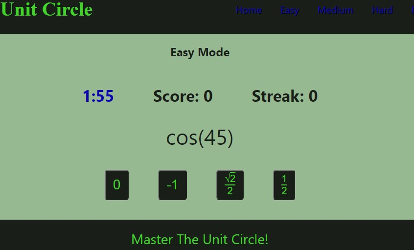

# Unit Circle

  

  

  ## Description
  I have worked with students for years on various subjects, and one of the common topics that students encounter is the Unit Circle from precalculus.  Being able to remember the trigonometric values of angles of the circle, both when the angles are expressed in degrees and when they are expressed in radians, seems to be required of every student in a precalculus or trigonometry course.  This application is a game of sorts that allows students to practice learning this information while saving certain statistics locally.  The project utilizes React and Redux.
  
  ## Link
  [Unit Circle](https://cabralwilliams.github.io/unit-circle/)
  
  ## Table of Contents
  
  * [Installation](#installation)
  * [Usage](#usage)
  * [License](#license)
  * [Contributing](#contributing)
  * [Tests](#tests)
  * [Questions](#questions)
  
  ## Installation
  
  If cloning this repository, the user would just need to run an npm install from the root directory of the project.  The project does not contain a back end, so there is no need to include any database or environment variables locally.
  
  ## Usage
  
  Once the files are installed, the user should run the command npm start from the command line in the root directory of the project.  Once this is done, the user should navigate to localhost:3000 and then select whichever option for difficulty that the user desires.  Alternately, the user can just use the live version, linked elsewhere in this document.
  
  ## License
  
  The content of this project is licensed under the [MIT License](https://opensource.org/licenses/MIT).  Please click [here](https://opensource.org/licenses/MIT) for more information about how you may use code in this project.

  ## Contributing

  If any developer has ideas about how this project can be improved, please feel free to reach out to me at the email address included in this document.
  
  
  ## Tests
  
  There was no formal testing utilized as the project was being created.  Troubleshooting was done using console.log directives when unexpected/undesired behavior arose.
  
  ## Questions
  [GitHub Profile](http://github.com/cabralwilliams)
  
  For any questions concerning this application, please contact me at cabral.williams@gmail.com.